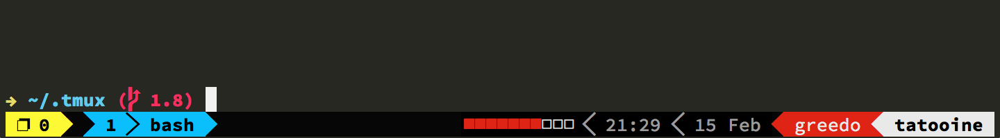

.tmux
=====

Self-contained, opinionated `.tmux.conf` configuration file.

The `master` branch targets tmux 1.9+. You may want to use the `1.7` or `1.8`
branch.

**Please note that the official tmux 1.9 and 1.9a SEGFAULT when using the
maximize pane feature. Some Linux distributions like Debian provide a patched
tmux 1.9a. Depending on whether or not the running tmux version has a buggy
`swap-pane` command, the maximize pane feature may be disabled. On Mac OS X,
I've been using tmux `HEAD` for a while without troubles (`brew install --HEAD
tmux`). The `swap-pane` command has been fixed in upstream by commit
`78e783e`.**

Features
--------

 - `C-a` acts as secondary prefix, while keeping default `C-b` prefix
 - visual theme inspired by [powerline](https://github.com/Lokaltog/powerline)
 - [maximize any pane to a new window with `<prefix>+`](http://pempek.net/articles/2013/04/14/maximizing-tmux-pane-new-window/) (tmux 1.6+)
 - mouse mode toggle with `<prefix>m`
 - automatic usage of `reattach-to-user-namespace` if available
 - laptop battery status

Installation
------------

    $ cd
    $ rm -rf .tmux
    $ git clone https://github.com/gpakosz/.tmux.git
    $ ln -s .tmux/.tmux.conf
    $ cp .tmux/.tmux.conf.local .

If you're a ViM user, setting the `$EDITOR` environment variable to `vim` will
enable and further customize the vi-style key bindings (see tmux manual).

### Configuring the visual theme

You first need to install [fonts patched with powerline symbols] (see also
[powerline manual]).

Then edit your `~/.tmux.conf.local` file and uncomment the following line:

    #tmux_conf_theme=powerline_patched_font

[fonts patched with powerline symbols]: https://github.com/Lokaltog/powerline-fonts
[powerline manual]: http://powerline.readthedocs.org/en/latest/installation.html#fonts-installation

### Configuring the battery indicator

Edit your `~/.tmux.conf.local` file and uncomment the following lines:

    #tmux_conf_battery_symbol=heart
    #tmux_conf_battery_symbol_count=5

See `~/.tmux.conf.local` for more details.

### Accessing the Mac OSX clipboard from within tmux sessions

[Chris Johnsen created the `reattach-to-user-namespace`
utility](https://github.com/ChrisJohnsen/tmux-MacOSX-pasteboard) that makes
`pbcopy` and `pbpaste` work again within `tmux`.

If available, `reattach-to-user-namespace` will be automatically used by this
`tmux` configuration. You just have to install it for instance with `brew`:

    $ brew install reattach-to-user-namespace
